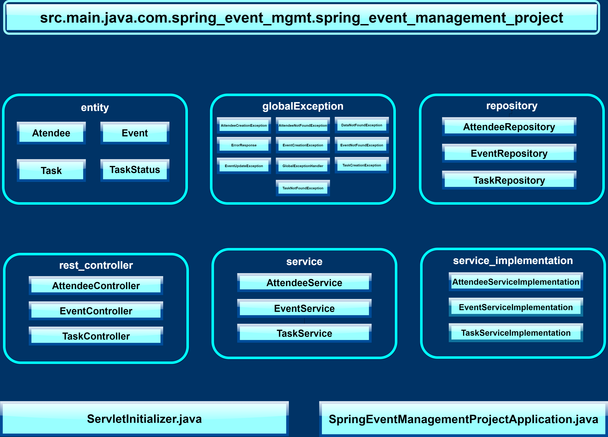

# Event Management Dashboard

## Project Overview

This project is a web-based **Event Management Dashboard** designed to help organizations efficiently organize, manage, and track their events. The application provides an easy-to-use interface for managing events, attendees, and tasks, allowing users to:

- Create, update, and delete events.
- Manage event attendees and assign them tasks.
- Track the progress of tasks associated with events.

The solution is developed using **React** for the frontend, **Spring Boot** for the backend, and **Material UI (MUI)** for building the user interface.

## Problem Statement

Organizations often struggle to efficiently organize and manage events. This application aims to solve that problem by providing a centralized platform for managing events, tasks, and attendees. With this platform, users can streamline the process of creating events, assigning tasks to attendees, and tracking task progress.

### Key Features:
- **Event Management**: CRUD operations for managing events.
- **Attendee Management**: View, add, and remove attendees; assign them tasks.
- **Task Tracker**: Track the progress of tasks related to events.

## Tech Stack

- **Frontend**:
  - **React.js**: A JavaScript library for building user interfaces.
  - **Material UI (MUI)**: A React UI framework for building responsive, modern, and accessible components.
  - **React Router**: For navigation between pages.
  - **Axios**: For making HTTP requests to the backend API.

- **Backend**:
  - **Spring Boot**: A framework to build Java-based web applications.
  - **Spring Web**: For creating RESTful web services.
  - **Spring Data JPA**: For easy database interaction with Spring.
  - **H2 Database**: In-memory database for easy setup during development.

## Project Approach

### Frontend Development

The frontend consists of three main pages:
1. **Event Management Page**: Displays all events and allows users to add, edit, or delete events. Each event displays its name, description, location, and date.
2. **Attendee Management Page**: Lists all attendees and provides options to add or remove them. Users can also assign attendees to specific events or tasks.
3. **Task Tracker Page**: Allows users to manage tasks for each event, providing the option to update the task status (Pending/Completed).

### Backend Development

The backend exposes a set of RESTful APIs to handle CRUD operations for events, attendees, and tasks. The main APIs are:
1. **Event Management API**: 
   - Create an Event
   - Get all Events
   - Update an Event
   - Delete an Event
2. **Attendee Management API**:
   - Add an Attendee
   - Get all Attendees
   - Delete an Attendee
3. **Task Management API**:
   - Create a Task
   - Get Tasks for an Event
   - Update Task Status



### Integration

The frontend is integrated with the backend using Axios to make HTTP requests to fetch and manipulate data. The user interface displays real-time data fetched from the backend, and success/error messages are shown upon completing API calls.

## UI Guidelines

- **Responsiveness**: The application is built to be fully responsive, meaning it will work well on both mobile and desktop devices.
- **Form Validation**: The input forms for adding events, attendees, and tasks include validation to ensure that no fields are empty, and all dates are valid.
- **User Experience**: The interface is designed to be intuitive and easy to use, with loading indicators and success/error messages to improve user interaction.

## Setup Instructions

### Prerequisites

1. **Node.js** and **npm** for the frontend setup.
2. **Java 17+** and **Maven** for the backend setup.

### Frontend Setup (React + MUI)

1. Clone the repository:

   ```bash
   git clone https://github.com/yourusername/event-management-dashboard.git
   cd event-management-dashboard/frontend
   ```

2. Install dependencies:

   ```bash
   npm install
   ```

3. Run the React application:

   ```bash
   npm start
   ```

   The application will be available at `http://localhost:3000`.

### Backend Setup (Spring Boot)

1. Clone the repository:

   ```bash
   git clone https://github.com/yourusername/event-management-dashboard.git
   cd event-management-dashboard/backend
   ```

2. Build and run the Spring Boot application using Maven:

   ```bash
   ./mvnw spring-boot:run
   ```

   The backend will be available at `http://localhost:8080`.

### Database Setup

The application uses an **H2 database** for quick and easy setup during development. The database is embedded and does not require additional configuration. Data will be stored in-memory, so it will be cleared when the application restarts.

### API Endpoints

- **Event Management**:
  - `POST /api/events`: Create an event.
  - `GET /api/events`: Retrieve all events.
  - `PUT /api/events/{id}`: Update an event.
  - `DELETE /api/events/{id}`: Delete an event.

- **Attendee Management**:
  - `POST /api/attendees`: Add an attendee.
  - `GET /api/attendees`: Retrieve all attendees.
  - `DELETE /api/attendees/{id}`: Delete an attendee.

- **Task Management**:
  - `POST /api/tasks`: Create a task.
  - `GET /api/tasks/{eventId}`: Retrieve all tasks for a specific event.
  - `PUT /api/tasks/{id}`: Update the status of a task.

## Project Structure

```
event-management-dashboard/
├── backend/
│   ├── src/
│   │   ├── main/
│   │   │   ├── java/
│   │   │   └── resources/
│   ├── pom.xml
├── frontend/
│   ├── public/
│   ├── src/
│   ├── package.json
└── README.md
```

## Contributing

Feel free to fork the repository and submit pull requests for improvements or bug fixes. All contributions are welcome!

## License

This project is licensed under the MIT License - see the [LICENSE](LICENSE) file for details.
"# EVENT-MANAGEMENT-DASHBOARD" 
